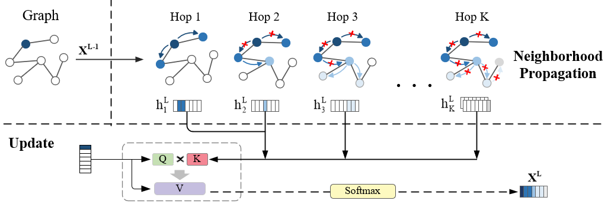

# Graph Elimination Networks
A graph neural network that improves the algorithm’s performance in capturing long-range node dependencies by eliminating redundancy in propagation. This project is the official implementation of the paper "Graph Elimination Networks".


## Installation
* Tested with Python 3.8, PyTorch 1.11.0, and PyTorch Geometric 2.2.0
* Alternatively, install the above and the packages listed in [requirements.txt](requirements.txt)
```
pip install -r requirements.txt
```
## Overview
* `/tu_dataset` <br/> The code in this file supports running on any graph dataset contained in the [TUDataset](https://chrsmrrs.github.io/datasets/docs/home/).
* `/ogb`  <br/> Contains four datasets from the [Open Graph Benchmark (OGB)](https://github.com/snap-stanford/ogb) used in the paper experiments, the code is from the official GCN baseline, and only supports full-batch training.
* `models` <br/> The experiments reproduce the methods of related papers, and the sources of the code are acknowledged in the comments.If you want to test our method, please use GENsConv, which can be used similarly to gcn or gat, and the code comments provide guidance on parameter tuning. For the usage of other methods, please consult the official code documentation from the original papers.

## Training & Evaluation
Run with default config
```
# TUDataset
cd ./tu_dataset
python main.py

# OGB
cd ./ogb/arxiv
python gnn.py

# ZINC
cd ./pyg_dataset/zinc
python gnn.py
```
The default configs are not always optimal, but they can usually reproduce the results in our paper by adjusting the dropout or the K value in the model. Some datasets require special processing methods (such as using degree as node features, or adding edge features to node features), which are adopted from the baseline methods and are essential steps.
